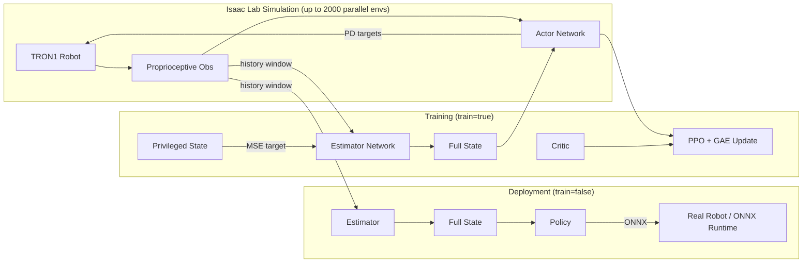

<div align="center">

# SF_TRON_FN

**Massively parallel reinforcement learning for bipedal locomotion of the TRON1 robot.**

Built on [NVIDIA Isaac Lab](https://isaac-sim.github.io/IsaacLab/) + [PyTorch](https://pytorch.org/), this repository trains a walking policy with **PPO** augmented by a **privileged-state estimator** (teacher–student / privileged learning), enabling deployment without privileged sensors.

</div>

---

## Overview

`SF_TRON_FN` is a GPU-accelerated RL framework that trains the **TRON1** bipedal robot to walk in simulation and transfers the policy to the real robot. Up to **2,000 agents** are simulated in parallel, and the entire training loop (observation, action, reward, update) is written in **vectorized PyTorch** so no CPU-GPU data transfer occurs inside the loop.

The core idea is **privileged learning**:

- The **policy (student)** only ever sees *proprioceptive* observations — joint states, IMU, body orientation, clock signals, and a velocity command.
- A lightweight **estimator network (teacher)** is trained to regress *privileged* states — external forces, body linear velocity, and foot contact/ground-reaction forces — from a sliding window of those same proprioceptive observations.
- At deployment time, the estimated privileged state is concatenated with the proprioceptive state and fed to the policy, so the robot never relies on sensors that do not exist in the real world.

Combined with aggressive **domain randomization** (mass, center of mass, inertia, friction, restitution, PD gains, action delay, and external disturbances), the framework is designed for robust **sim-to-real transfer**.

<div align="center">



</div>

## Key Features

- **Massively parallel training** — 2,000 vectorized agents on a single GPU, no Python loops over environments.
- **PPO with GAE** — actor-critic with a shared MLP backbone, clipped surrogate objective, entropy regularization, and an action-smoothing term.
- **Privileged-state estimator** — a teacher network that reconstructs unobservable quantities from a 10-step history of proprioception, letting the deployed policy drop privileged sensors entirely.
- **Rich reward shaping** — velocity tracking, body height/orientation, foot constraint, single-support gait, foot air-time, stand-still, and termination penalties.
- **Domain randomization** — mass, COM, inertia, friction, restitution, PD gain, action delay, and random external forces/torques.
- **PD torque control** — position-based PD controllers with randomized gains and simulated actuation delay.
- **ONNX export** — actor and estimator are exported to ONNX for on-robot inference.

## Robot & Task

| Item | Detail |
| --- | --- |
| Robot | TRON1 bipedal robot (`Model/Robot_Model/SF_TRON1A.usd`) |
| Actuators | 8 joints (6 legs + 2 ankles), implicit PD torque control |
| Control frequency | 50 Hz policy (`dt = 0.02 s`), 500 Hz simulation (`sub_step = 10`) |
| Sensors | body IMU, ankle IMUs, ankle contact sensors |
| Command | forward velocity command `vel_cmd` (`0` = stand still, `1` = walk) |
| Observation | 33-D proprioceptive state + 8-D estimated privileged state |

## Project Structure

```
SF_TRON_FN/
├── Run_with_Estimator.py        # Main training / evaluation loop
├── torch2onnx.py                # Export actor + estimator to ONNX
├── model1.onnx / model2.onnx    # Exported actor / estimator
├── SRC/
│   ├── Config/
│   │   ├── Config.py            # All hyperparameters (Env / Robot / PPO / Estimator)
│   │   └── TS_Config.py         # Teacher-student state-dim adjustment
│   ├── Env/
│   │   ├── BaseEnv.py           # Base environment (state, reset, randomization)
│   │   ├── TronEnv.py           # Task-specific observation, reward, step logic
│   │   ├── SceneSetup.py        # Isaac Lab scene + domain randomization
│   │   └── SoftwareSetup.py     # Isaac Lab AppLauncher setup
│   ├── PPO/
│   │   ├── Actor_Critic.py      # Actor / Critic networks + PPO update
│   │   └── Buffer.py            # Rollout buffer + GAE computation
│   ├── Estimator/
│   │   └── Estimator.py         # Privileged-state estimator (teacher network)
│   ├── Plotter/
│   │   └── ImagePlotter.py      # Real-time plotting of estimated vs. real GRF
│   └── Utils/
│       └── Transformation.py    # Euler/quaternion, yaw transform helpers
└── Model/
    ├── Robot_Model/             # Robot USD + URDF/xacro description
    ├── NN_Model/                # Trained weights (.pth)
    └── tron1-rl-deploy-python-main/  # MuJoCo-based deployment controller
```

## Installation

### Prerequisites

- Ubuntu 20.04/22.04 with an NVIDIA GPU (tested with Isaac Lab)
- [Isaac Lab](https://isaac-sim.github.io/IsaacLab/main/source/setup/installation/index.html) (or Isaac Sim 4.x)
- Python 3.10+
- PyTorch with CUDA support

### Setup

```bash
# 1. Clone the repository
git clone https://github.com/Yiyou6/SF_TRON_FN.git
cd SF_TRON_FN

# 2. Create and activate a virtual environment
python -m venv .venv && source .venv/bin/activate

# 3. Install dependencies (adjust for your Isaac Lab install)
pip install torch torchvision --index-url https://download.pytorch.org/whl/cu121
pip install onnx onnxruntime matplotlib

# 4. Make sure Isaac Lab is on your PYTHONPATH, or run from within its environment
```

> **Note:** `SceneSetup.py` imports `isaaclab.*` packages. Run the scripts inside your Isaac Lab virtual environment so the `isaaclab` package resolves correctly.

## Usage

### Train

Set `train = True` in `SRC/Config/Config.py` (both `EnvParam.train` and `EnvParam.headless`), then run:

```bash
python Run_with_Estimator.py
```

The training loop runs 3,000 episodes, saves the best actor/critic/estimator to `Model/NN_Model/` (`*_f.pth` keeps the latest, `*.pth` the best), and prints a per-episode reward breakdown after every update.

### Evaluate

Set `train = False` and `headless = False` in `SRC/Config/Config.py` to load the best models and render the GUI:

```bash
python Run_with_Estimator.py
```

### Export to ONNX

```bash
python torch2onnx.py
```

This exports:
- `model1.onnx` — the actor (input: 33-D proprioceptive + 8-D estimated privileged = 41-D),
- `model2.onnx` — the estimator (input: 10-step history = 330-D).

## Configuration

All hyperparameters live in `SRC/Config/Config.py`, grouped by concern:

| Group | Highlights |
| --- | --- |
| `EnvCfg.EnvParam` | `agents_num` (2000), `dt` (0.02), `sub_step` (10), `train`, `device` |
| `RobotCfg.ActuatorParam` | 8 actuators, `Kp`/`Kd` gains, default PD angles |
| `RobotCfg.InitialState` | spawn height, initial pose/velocity ranges |
| `RobotCfg.DomainRandomizationCfg` | mass / COM / inertia / friction / restitution / PD-gain ranges, action delay, external force |
| `PPOCfg.CriticParam` | `state_dim` (33+8), layer width, learning rate |
| `PPOCfg.ActorParam` | action scale, std scale, layer width, learning rate |
| `PPOCfg.PPOParam` | `gamma`, `lam`, `epsilon`, `maximum_step` (25), `episode` (3000), `batch_size` |
| `PPOCfg.EstimatorParam` | `history_length` (10), `output_dim` (8), layer width, learning rate |

## License

This project does not currently specify a license. Add a `LICENSE` file if you intend to open-source it.
